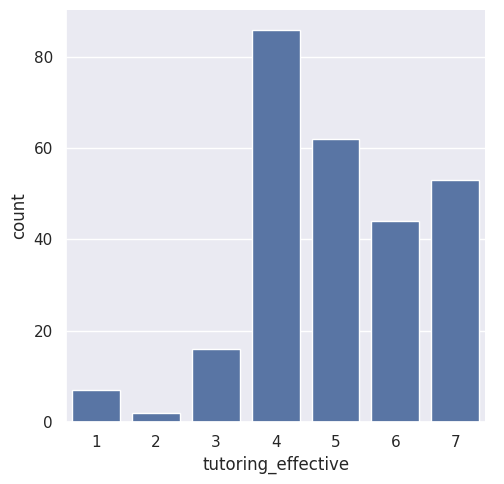
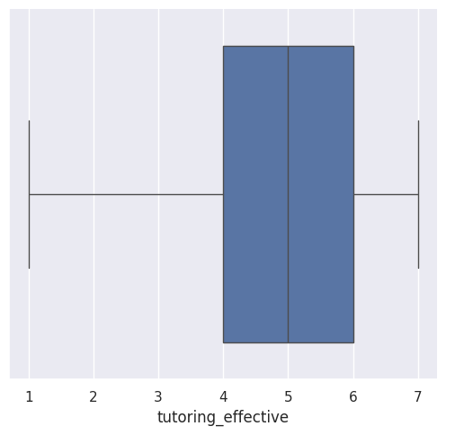
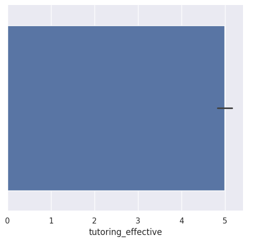

---
# Do not edit the text between these lines!
layout: default
---

# ex09: How Effective do Students Think Comp110 Tutoring is?

<!-- This is a comment. Below, you'll see code for inserting an image. To make this image appear, update <custom-path>. To add an image, save it inside the imgs folder of this repository. -->

## Analysis Summary
The original suggestion for improvment was increasing tutoring hours as it would help students in Comp110. To analyze the data behind this question we can use the data.utils functions to help us!

First, I needed to extract the responses to the  "tutoring_effective" question from both sections' surverys. I did this by using "read_csv_rows" and "columnar" to translate the survey data into a structure that python can work with. I was then able to use the "concat" function to combine the datasets from the different classes.

Next, I used "select" to specifically harvest the "tutoring_effective" data which consisted of scores 1-7. 1 being tutoring was completely unhelpful and 7 being tutoring was extremely helpful. I then used "head" to preview the first 5 lines of this data.

Then, I wanted to filter out the empty responses of students who did not attend tutoring during the semester. I did this by writing a helper function "filter" that created a new data list that exculded any empty responses. 

From there, I used "count" to get the frequencies of each score, then used "convert_columns_to_int" for Seaborn to create visual data interpretations.

## Data Visualizations
 
 

## Final Conclusions
Based on the data found, the results were not confidently conclusive. The most frequent answer (mode) was "4" meaning that most students who attended found tutoring neither helpful or unhelpful. However, 159 students gave tutoring a score of a 5, 6, or 7, meaning they thought tutoring WAS effective. This is a much larger number compared to the 25 students who rated tutoring a 1, 2, or 3, meaning unhelpful. However, our mean was 5, meaning slightly helpful, as visualized by the bar chart. To make this data completely conclusive, we would want to see a mean and median of 7 or 6. To improve upon this investigation, there could be another question asking how many times a student went to tutoring and if that correlates with a higher score. Did a student have 1 poor tutoring session and never go back? Did one student go regularly over the semester and find a good overall experience? By experimenting with this data, our stakeholders are primarily our tutors and our students. This could possibly effect the hours the tutors volunteer and how many are avalible. This could also limit student access to tutoring if the results lead to an influx of students going to tutoring without more tutors/ more tutoring hours becoming accessible.